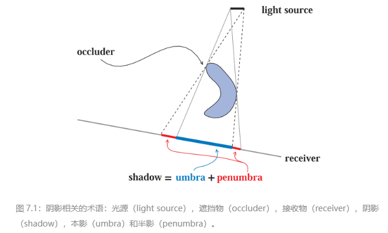
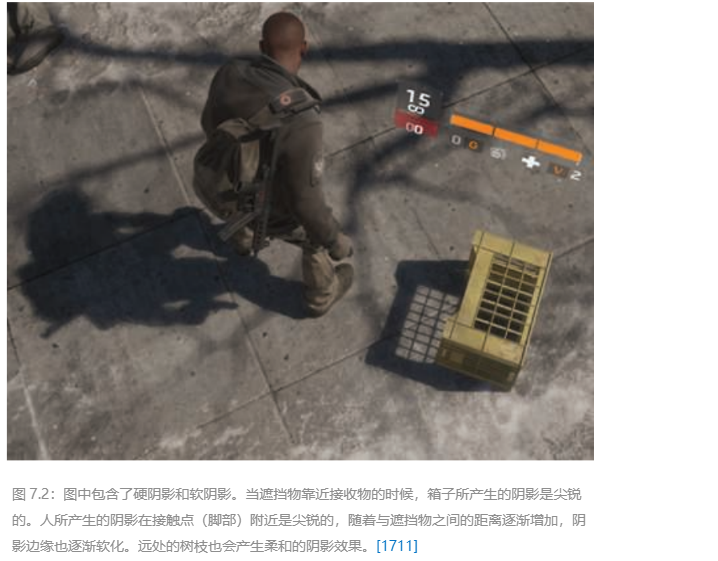
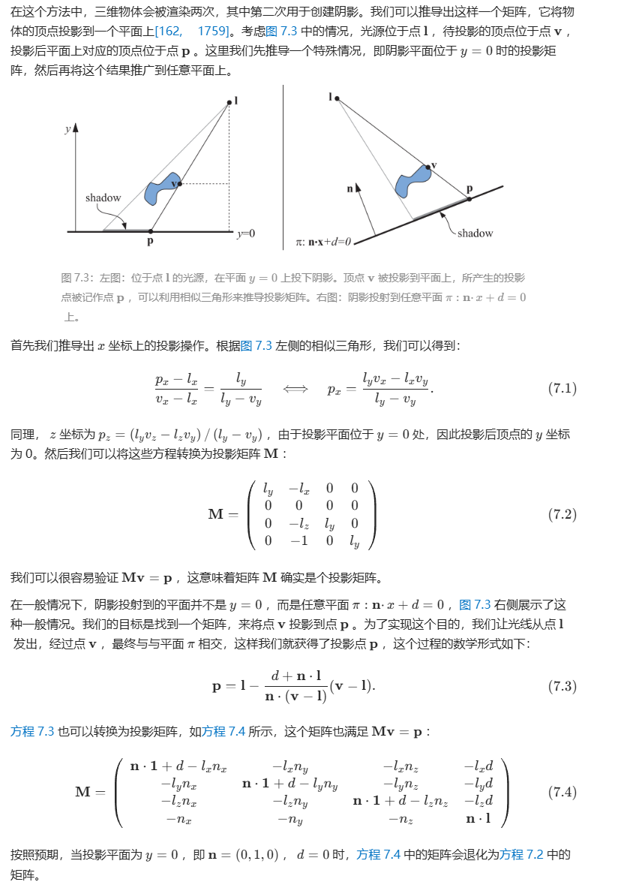
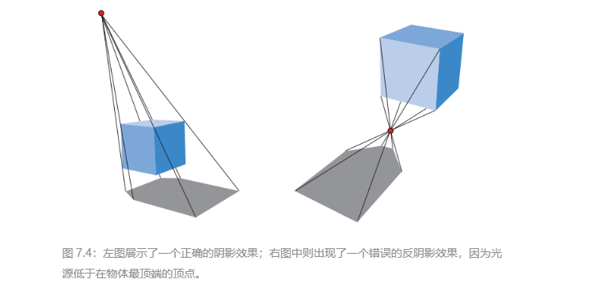

# Chapter 7 Shadows 阴影

## 硬阴影和软阴影

* 如果使用了**没有面积的光源**，只会产生完全被阴影覆盖的区域（本影），这样的阴影有时候会被称为**硬阴影（hard shadow）**。

* 如果使用了**面光源或者体积光源**，那么则会产生**软阴影（soft shadow）**。

* 每个阴影都有一个完全被阴影覆盖的区域，称为本影（umbra）；以及一个部分被阴影覆盖的区域，称为半影（penumbra）。

### 正确的软阴影效果

* **软阴影真实感更强但渲染花费更大**：软阴影比边界明确、易被误认为几何折痕的硬阴影更具真实感，但硬阴影的渲染速度要快得多。
* **软阴影的遮挡物越靠近投影物阴影边缘就越清晰**：真正的软阴影不能只靠简单模糊硬阴影边缘来实现，其核心特征是遮挡物越靠近接收物，阴影边缘就越清晰。
* **本影区的动态变化**：软阴影的本影区域大小取决于光源和距离，光源越大或接收物距离遮挡物越远，本影区域就会越小，甚至可能完全消失。

## 平面阴影
遮挡物在平面上投射阴影就是平面阴影

### 投影阴影

#### 反阴影错误

**所有的遮挡物必须位于光源和地面接收物之间。如果光源位于遮挡物下方，那么则会出现反阴影（antishadow）现象**

## 软阴影